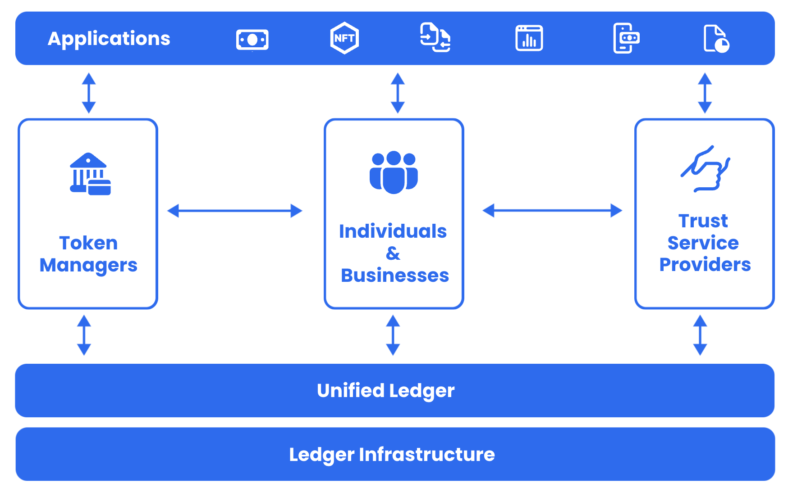

# Finternet Sandbox

### Welcome to Finternet

The Finternet aims to enable multiple ecosystems to interconnect, much like the internet, thus empowering 8+ billion individuals and 300+ million businesses by placing them at the center of their financial lives. It  is a user centric, unified, & universal approach to finance.

The objective of the sandbox is to encourage participation of various technical service providers and asset issuers on the Finternet. The prototype provides a set of protocols and schemas along with a developer sandbox. 

The sandbox consists of ledger interfaces and infrastructure that various tech providers can plug their solutions into. Financial institutions and asset issuers can also be observers on the sandbox:

- Developers can build apps and infrastructure
- Financial Institutions can issue tokens
- Regulators can participate as observers

### Tracks

1. **User Application**: The application layer provides the end user interface to the Finternet. It enables users with various workflows that can be performed across asset classes.
2. **Token Manager Admin**: This is the application layer for the token manager to interface with the Finternet. It enables token managers with various workflows that can be performed on the assets issued by them
3. **Authenticator wallet**: The auth wallet is the mechanism for users to securely store bearer keys and use them to sign transactions across Finternet applications
4. **Unified Ledger**: The unified ledger is the interface to the ledger infra. It's an abstraction on top of the ledger specific infrastructure
5. **Ledger Infra**: This is the immutable record keeping layer of the Finternet
6. **Public Trust Registry**: This is a public registry of master data for trusted participants across the Finternet.
7. **Contract Marketplace**: This is the smart contract marketplace for token managers to ease implementation of asset specific rules.

### How you can participate

Try it out: [Finternet Playground](https://finternet-playground.vercel.app/)

Express your interest: [here](https://docs.google.com/forms/d/e/1FAIpQLSespmHeTAF1p1JNLnNaq5iHKp-QojDKWalEHJsB1XJ8becRTQ/viewform)

